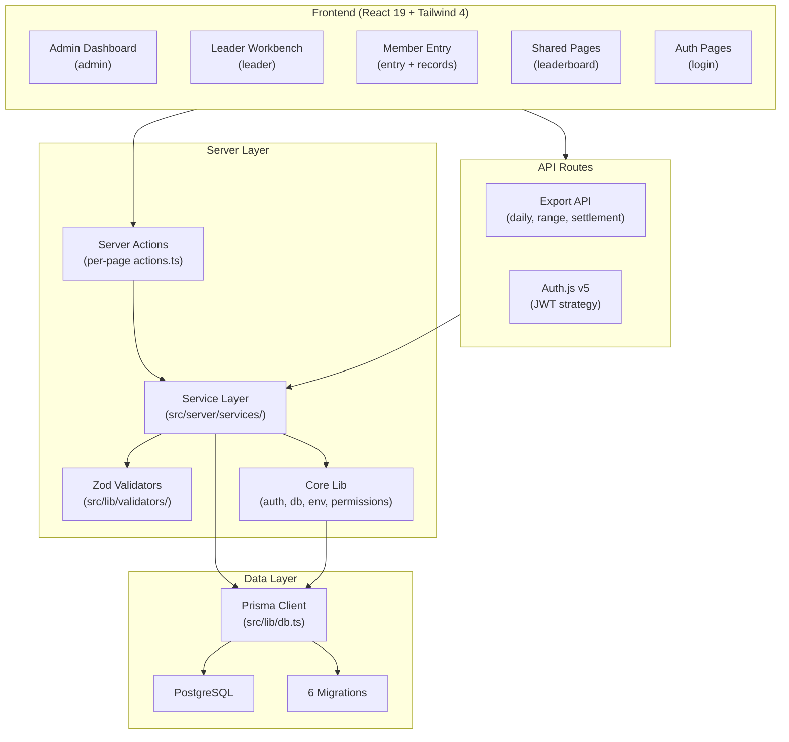
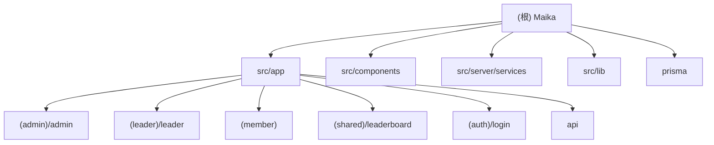
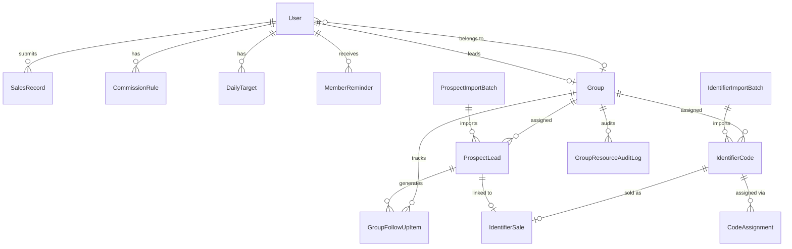

@AGENTS.md

# Maika - Campus Phone Card Sales Tracking System

> Last scanned: 2026-04-05T17:49:44 | 161 source files

## Project Vision

Maika is an internal campus phone card sales tracking and commission settlement system. It serves three user roles (Admin, Leader, Member) to manage daily sales entry, leaderboard rankings, commission settlement, identifier code distribution, prospect lead assignment, and group-level workbench operations. Deployed on Vercel with PostgreSQL.

## Architecture Overview



## Module Structure


## Module Index

| Module | Path | Files | Description |
|--------|------|-------|-------------|
| Admin Pages | `src/app/(admin)/admin/` | 28 files | Member/code/sales/insights/settlement management |
| Leader Pages | `src/app/(leader)/leader/` | 6 files | Group workbench, leader sales tracking |
| Member Pages | `src/app/(member)/` | 5 files | Sales entry, personal records |
| Shared Pages | `src/app/(shared)/leaderboard/` | 3 files | Daily/range/group leaderboards |
| Auth Pages | `src/app/(auth)/login/` | 3 files | Login form + credential auth |
| API Routes | `src/app/api/` | 4 files | Auth handler + Excel export endpoints |
| Admin Components | `src/components/admin/` | 25 components | Admin-only tables, forms, panels |
| Leader Components | `src/components/leader/` | 6 components | Workbench ranking, follow-up, audit |
| Shared Components | `src/components/` | 27 components | Shell, charts, forms, entry UI |
| Service Layer | `src/server/services/` | 24 modules | All business logic + caching |
| Validators | `src/lib/validators/` | 13 schemas | Zod validation for all domains |
| Core Lib | `src/lib/` | 8 modules | auth, db, env, permissions, password, theme, content-types |
| Prisma Schema | `prisma/` | 9 files | Database schema + seed data |

## Tech Stack

| Layer | Technology | Version |
|-------|-----------|---------|
| Framework | Next.js (App Router) | 16.2.1 |
| UI | React + Tailwind CSS | 19.2.4 / 4 |
| Language | TypeScript (strict) | 5 |
| ORM | Prisma | 6.19.2 |
| Auth | Auth.js (next-auth v5) | beta.30 |
| Validation | Zod | 4.3.6 |
| DB | PostgreSQL | - |
| Deployment | Vercel | - |
| Monitoring | @vercel/analytics + @vercel/speed-insights | 2.0.1 / 2.0.0 |
| Testing | Vitest (unit) + Playwright (e2e) | 4.1.1 / 1.58.2 |
| Export | ExcelJS | 4.4.0 |
| Password | bcryptjs | 3.0.3 |

## Role-Based Access

| Role | Default Route | Access Scope |
|------|--------------|--------------|
| ADMIN | `/admin` | Admin + Member + Shared pages |
| LEADER | `/leader/group` | Leader + Shared pages |
| MEMBER | `/entry` | Member + Shared pages |

RBAC enforced at two layers:
1. **Proxy (middleware)**: `src/proxy.ts` wraps `auth()` to redirect unauthenticated/unauthorized requests
2. **Permission helpers**: `src/lib/permissions.ts` provides `canAccessAdmin`, `canAccessLeader`, `canAccessMemberArea`

Route groups `(admin)`, `(leader)`, `(member)` mirror role boundaries.

## Key Conventions

- **Path alias**: `@/*` maps to `src/*`
- **Middleware**: Next.js 16 uses `src/proxy.ts` (renamed from `middleware.ts`); wraps `auth()` for route protection
- **Server Actions**: each page folder has `actions.ts` + optional `form-state.ts`; all mutations go through Server Actions, never API routes
- **Service layer**: all business logic in `src/server/services/` -- no direct ORM calls in actions or components
- **Validation**: Zod schemas in `src/lib/validators/`, used in both actions and services
- **Auth**: JWT sessions via Auth.js v5, role stored in token, typed in `src/types/next-auth.d.ts`
- **DB singleton**: `src/lib/db.ts` exports `db` (PrismaClient), dev hot-reload safe via globalThis
- **Env validation**: `src/lib/env.ts` parses required env vars at startup with Zod
- **Caching**: 4 service-layer caches using `unstable_cache` with tag-based invalidation:
  - `leaderboard-cache` (30s TTL, tag: `leaderboard`)
  - `entry-insights-cache` (30s TTL, tag: `entry-insights`)
  - `shell-content-cache` (60s TTL, tag: `shell-content`)
  - `member-records-cache` (30s TTL, tag: `member-records`)
- **Cache invalidation**: uses `updateTag()` for tag-based revalidation + `revalidatePath()` for specific routes
- **Sales data aggregation**: `sales-reporting-service.ts` merges two sources (IdentifierSale + legacy SalesRecord), IdentifierSale takes priority per user-day
- **Theming**: 6 color themes stored in localStorage, SSR-safe via inline script in `<head>`
- **No API routes for mutations**: API routes only serve Excel export downloads (daily/range/settlement)
- **Time zone**: `Asia/Shanghai` is the default for date calculations

## Database Models (15)



Key enums: `Role` (MEMBER/LEADER/ADMIN), `SalesReviewStatus` (PENDING/APPROVED/REJECTED), `IdentifierCodeStatus` (UNASSIGNED/ASSIGNED/SOLD), `ProspectLeadStatus` (UNASSIGNED/ASSIGNED/CONVERTED), `GroupFollowUpStatus` (UNTOUCHED/FOLLOWING_UP/APPOINTED/READY_TO_CONVERT/INVALID/CONVERTED), `PlanType` (PLAN_40/PLAN_60).

## Environment Variables

| Variable | Required | Description |
|----------|----------|-------------|
| `DATABASE_URL` | Yes | PostgreSQL connection string |
| `AUTH_SECRET` | Yes | JWT signing secret (falls back to `NEXTAUTH_SECRET` or dev default) |
| `AUTH_TRUST_HOST` | No | Trust host header (default: `true` in dev, `false` in prod) |

## Run and Develop

```bash
npm run dev           # Start dev server (Turbopack)
npm run build         # prisma generate && next build
npm run start         # Start production server
npm run lint          # ESLint
```

## Test Strategy

```bash
npm test              # Vitest unit tests (71 files)
npm run test:watch    # Vitest in watch mode
npm run test:e2e      # Playwright E2E tests (9 files, Chromium, port 3100)
```

- **Unit tests**: Vitest + jsdom, `tests/unit/`, path alias via `vitest.config.ts`
- **E2E tests**: Playwright, `tests/e2e/`, single worker, auto-starts dev server on port 3100
- **Test coverage areas**: services, validators, actions, components, cache layers, page rendering
- **Mocking pattern**: service modules are mocked at import boundary in action/page tests

## Coding Conventions

- TypeScript strict mode, target ES2017
- `satisfies` operator used extensively for type-safe return shapes
- Service functions return typed DTOs, not raw Prisma objects
- Chinese locale (`zh-CN`) used for sorting names (`localeCompare`)
- Decimal fields use `Decimal(10,2)` in Prisma, converted via `.toString()` for serialization
- Date values use `DateValue` branded type (`YYYY-MM-DD` string)
- Export filenames follow `{type}-{date}.xlsx` pattern
- Seed script creates default admin (`admin/admin123456`) and member (`member01/member123456`)

## Design System
Always read `DESIGN.md` before making any visual or UI decisions. All font choices, colors, spacing, border-radius, and aesthetic direction are defined there. Do not deviate without explicit user approval. In QA mode, flag any code that doesn't match DESIGN.md.

## AI Usage Guidelines

- Always read `AGENTS.md` for Next.js 16 breaking changes before writing code
- Service layer is the single source of truth for business logic -- never bypass it
- When adding a new page: create `page.tsx` + `actions.ts` + optional `form-state.ts`
- When adding a new service: place in `src/server/services/`, export typed DTOs
- When adding a new validator: place in `src/lib/validators/`, use Zod
- Cache invalidation: call `refreshLeaderboardCaches()` / `refreshShellContent()` / etc. from actions after mutations
- All audit-sensitive operations in leader workbench use `$transaction` with before/after snapshots

## Changelog

| Date | Description |
|------|-------------|
| 2026-04-05T17:49:44 | Architecture scan, updated module counts (161 estimated total files), added mermaid module structure. |
| 2026-04-05T09:53:12 | Full rescan: corrected counts (71 unit tests, 24 services, 13 validators, 58 components), added module structure graph, expanded caching/convention docs, added module-level CLAUDE.md files |
| 2026-04-05 | Initial scan: 150 source files, 15 Prisma models, basic architecture docs |
## Design System
Always read DESIGN.md before making any visual or UI decisions.
All font choices, colors, spacing, and aesthetic direction are defined there.
Do not deviate without explicit user approval.
In QA mode, flag any code that doesn't match DESIGN.md.
